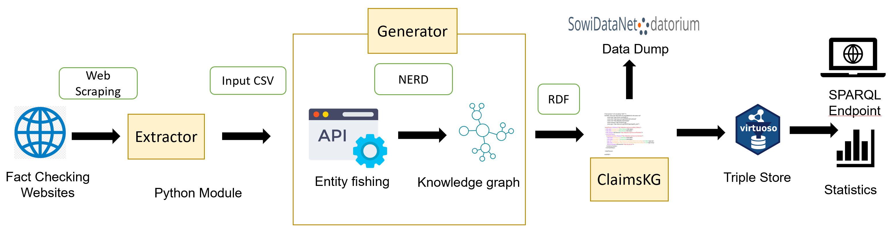
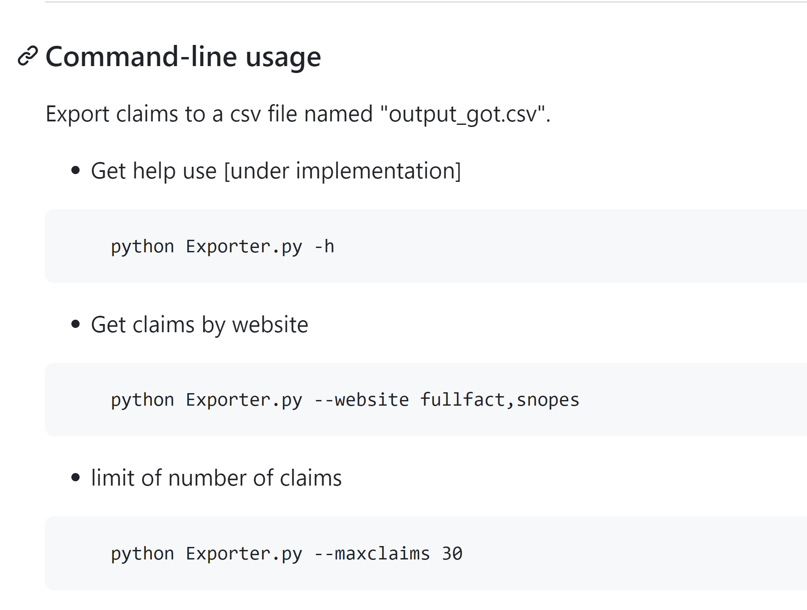

 
# Description:
This project constitutes the web scraping component of ClaimsKG that crawls fact checking sites (mostly taken from https://www.poynter.org/international-fact-checking-network-fact-checkers-code-principles, which holds a list of reliable fact-checking sites) and generates a CSV file with a dump of the extracted information.

The pipeline of ClaimsKG depicted below


## Websites  
The scrappers available are for the following websites and languages

## English

Fullfact - https://fullfact.org/

Snopes - https://www.snopes.com/

Politifact - http://www.politifact.com/

TruthOrFiction - http://TruthOrFiction.com

Checkyourfact - http://checkyourfact.com

AfricaCheck - https://africacheck.org/

AFP Fact Check - https://factcheck.afp.com/

## French
AFP Factuel - https://factuel.afp.com/

## Russian
Factograph - https://www.factograph.info/

## Arabic
Fatabyyano - https://fatabyyano.net/en/

## Regional Languages(, Hindi, Punjabi, Assamese, Tamil, Malayalam, Gujarati, Telegu, Marathi, Odia, and Bengali)
Vishva news -https://www.vishvasnews.com/


## Statistics 
See the ClaimsKG dataset website for statistics (https://data.gesis.org/claimskg/#Statistics)

## Features Extracted
"Claim" : Textual statement of the claim which is being verified

"Credibility" : Truth rating provided by the respective sites in its original form

"URL" : URL of the corresponding source page

"body" : Description provided by the source article about why the claim is true or false

"Date" : : Date when the claim was made.

"Referred Links" : References used for verifying the claim.

"Tags" : Set of tags or topics provided by the fact checking site.

"Normalized Credibility" : FALSE, TRUE, MIXED, OTHER


## Normalizing truth values (ratings) across fact-checking websites
Given the varied rating schemes used by the fact-checking websites, where individual labels often are hard to objectively apply or interpret, we apply a simple normalized rating scheme consisting of four basic categories that can be mapped in a consensual way to all existing rating schemes: TRUE, FALSE, MIXTURE, OTHER. We provide full correspondence tables here: https://data.gesis.org/claimskg/ratings.pdf

### Keywords
Claims, Fact-checking, Web scrapping

### Social Science Usecases

Collection of data from promiment fact-checking websites for the purpose of various social science studies like fake news and misinformation, claim detection and analysis


## Repository Structure


All extractors for the website listed above present in claim_extractor folder

Redis docker - Dockerfile

Exported.py - main python file

Requirements.txt- Allrelevant packages required for the project


# Data
sample output generated by the extractor module in output_got.csv and output_sample.csv in the main directory


## Prerequisites
This reimplementation runs on Python3.5+. Redis is used for caching HTTP querries in order to allow faster resuming of extractions in case of failure and for a faster iterative development of new extractors. Please make sure to have a Redis instance (default parameters) running on the machine that runs the extractor. 
 
# Environment Setup

Expected package dependencies are listed in the "requirements.txt" file for PIP, you need to run the following command to get dependencies:

pip install -r requirements.txt




### Limitation
The layouts of the websites changes frequently. In that case, modifications to the code would be required


## Publication 
1. ClaimsKG: A knowledge graph of fact-checked claims (Tchechmedjiev, A., Fafalios, P., Boland, K., Gasquet, M., Zloch, M., Zapilko, B., ... & Todorov, K. (2019). ClaimsKG: A knowledge graph of fact-checked claims. In The Semantic Web–ISWC 2019: 18th International Semantic Web Conference, Auckland, New Zealand, October 26–30, 2019, Proceedings, Part II 18 (pp. 309-324). Springer International Publishing.)
git push -uf origin main
2. Truth or dare: Investigating claims truthfulness with claimskg (Gangopadhyay, S., Boland, K., Dessí, D., Dietze, S., Fafalios, P., Tchechmedjiev, A., ... & Jabeen, H. (2023, May). Truth or dare: Investigating claims truthfulness with claimskg. In D2R2’23-Second International Workshop on Linked Data-driven Resilience Research (Vol. 3401).)


# Contact

Susmita.gangopadhyay@gesis.org
```
